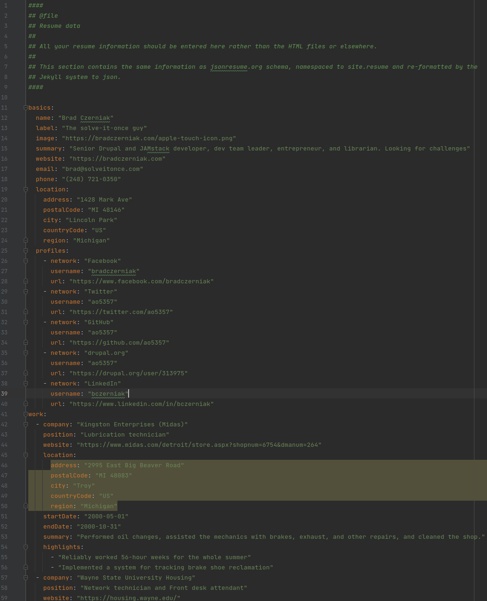

# Resume

An online résumé you can fork and host for free on GitHub quickly and without fuss.

All the information is in the `_config.yml` file at the root and `_data/resume.yml` file. If you have all your employment
and education info at the ready, you can have a **free resume online in ten minutes**. The only prerequisite is _kind of_
knowing how [YAML](https://en.wikipedia.org/wiki/YAML) works.

It renders as a nice page. The styling is set up to print a one-page version (three most recent jobs and two most recent
degrees).

## Features

  * Fully Customizable - mostly from one easy file
  * Dark mode! Also `prefers-reduced-motion` and `prefers-contrast` styling so everyone can enjoy the page
  * [schema.org](https://schema.org/) microdata
  * [JSON resume](https://jsonresume.org/) format at `/assets/data/resume.json`
  * [h-resume](http://microformats.org/wiki/h-resume) Microformat
  * 100% [Lighthouse](https://developers.google.com/web/tools/lighthouse/) scores for Accessibility, Performance, Best
    Practices, and SEO
  * Scripts to turn it into PDF and Microsoft Word versions (requires local repo and [pandoc](https://pandoc.org/))
  * Can be deployed entirely on GitHub; no node dependencies or build steps
  * Attractive-but-generic imagery for social sharing and other purposes

## Getting Started

If you want, at least for the time being, to host the resume at `https://your-username.github.io/resume`, getting started
is a two-step process:

  1. Click the 'fork' button at the top of the [repo page](https://github.com/lowerbarriers/resume)
  2. Edit the `_config.yml` file in the code listing with your information

### Third-party providers

If you want to use netlify,

If you prefer Vercel,

## Creating a local version for development

  1. Clone the repository to your local machine
  2. `cd` into it
  3. Run the command `bundle install` in the root of the project to get the Jekyll standard items (requires [bundler](https://bundler.io/))
  4. Run `bundle exec jekyll serve --verbose` to build and serve your site to `http://localhost:4000/`

## PRs welcome!

If you want to drive the future of this project, your work is quite welcome. If you'd like more information about the project,
check out:

  * [CONTRIBUTING](.github/CONTRIBUTING.md)
  * [SUPPORT](.github/SUPPORT.md)
  * [SECURITY](.github/SECURITY.md)
  * [LICENSE](LICENSE)
  * [CODE_OF_CONDUCT](.github/CODE_OF_CONDUCT.md)
